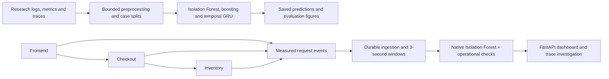
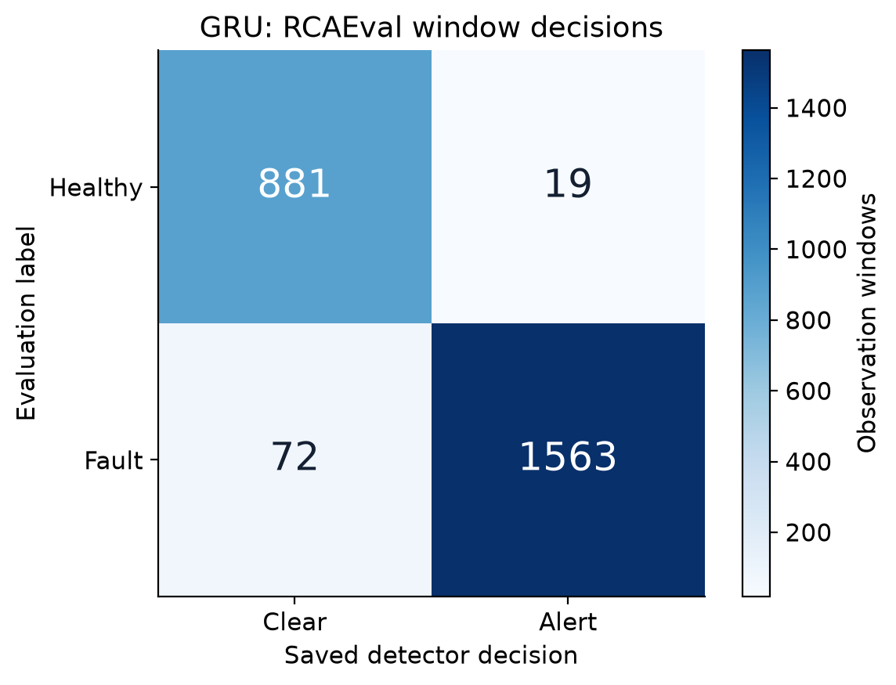
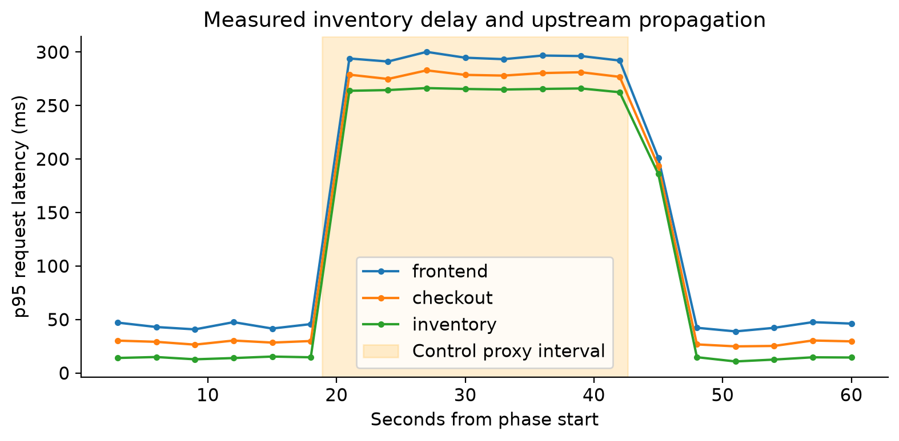

# 🔍 IncidentLab

### ML-Based Cloud Incident Detection and Investigation

**Python · PyTorch · scikit-learn · FastAPI · Docker · Kubernetes (kind) · SQLite**

Detect unusual service behavior. Follow request evidence. Understand how a fault spreads across microservices.

IncidentLab combines **machine learning, cloud observability and controlled fault experiments** in an end-to-end project. It processes logs, metrics and distributed traces, evaluates anomaly-detection models, serves saved checkpoints on CPU and presents evidence through an interactive dashboard.

> **Status:** Research and the controlled local Kubernetes demonstration are complete. Industrial reliability remains unverified. New LLM generation and automatic remediation are disabled.

## 💡 What problem does it solve?

A slow inventory service can make checkout and frontend look slow too. An alert tells you something changed; request traces help explain where the change occurred and which services were affected.

IncidentLab connects those two steps: **detect abnormal behavior, then investigate it using captured telemetry**.

## ✨ Features

- **Multimodal ML:** Features from logs, metrics and traces; Isolation Forest, boosting and a temporal GRU.
- **CPU serving:** Frozen checkpoints and FastAPI inference without an NVIDIA GPU.
- **Interactive dashboard:** Research replay, bounded HTTP demos, cluster evidence and downloadable figures.
- **Durable telemetry:** SQLite ingestion, duplicate rejection, chronological replay and restart state.
- **Fault experiments:** Frontend → checkout → inventory, with delay, HTTP-error and unavailability trials.
- **Evidence-supported investigation:** Request timing, status codes, dependency traces and capture reports.
- **Reproducible evaluation:** Saved predictions, reports, source hashes and held-out workloads.

## 📊 Measured results

| Evaluation | Result | Meaning |
|---|---:|---|
| RCAEval processing | 733 eligible cases; 49.7M logs; 110.7M spans | Original processing, not a new laptop download |
| Case partitions | 439 / 147 / 147 | Training / validation / development-test |
| Research GRU | F1 **0.972** | Development-test window metric; external transfer was weak |
| Original native HTTP trials | Operational **18/18**; ML **10/18** | Controlled local experiment on the college PC |
| Laptop Kubernetes trials | Operational **9/9**; ML **4/9** | Separate deployment; trial flags, not guaranteed causal diagnoses |
| Chronological replay | **300 windows; zero mismatches** | Reproduced features, scores and decisions |
| Container restart check | **8/8 tail traces recovered** | One controlled restart; zero duplicate poll insertions |
| Lean CPU checks | **75 tests passed locally** | Optional transformer diagnosis module excluded; not a claimed GitHub CI run |

Operational results include latency/error envelopes and coverage checks. They are not ML-only results. The frozen GRU alerted on only 3/24 external AnoMod fault runs; missing healthy/onset labels prevent an external precision/F1 claim. Capture review found 21 incomplete successful trace chains near pod deletion. Negative results remain included.

## 🧭 Architecture



Research features and the live HTTP detector use separate schemas/checkpoints. The applications run in Kubernetes pods during cluster experiments; inference, capture and the dashboard run on the Windows host. The local HTTP demo does not require Docker.

## 🚀 Quick start — Windows, CPU only

Prerequisite: official 64-bit Python 3.14 with the `py` launcher. This setup installs CPU dependencies, verifies publication hashes and loads saved checkpoints. It does not retrain models or download raw datasets.

```powershell
git clone https://github.com/Pavan-amikula/IncidentLab.git
cd IncidentLab
powershell -ExecutionPolicy Bypass -File .\Setup-GitHub.ps1
powershell -ExecutionPolicy Bypass -File .\Start-Laptop.ps1
```

Open **http://127.0.0.1:8768/**.

1. Choose **Live demo** and run healthy traffic.
2. Run the **Inventory delay** test.
3. Compare latency, errors and warnings; inspect request evidence.
4. Open **Figures** to view or export evaluation charts.

The bounded demo lasts one minute and collects 20 observation windows. Saved results remain available afterward. Opening the dashboard does not launch training.

```powershell
# Run the lean CPU suite after setup.
.\.venv-laptop\Scripts\python.exe -m scripts.test_laptop
```

This GitHub edition uses `Setup-GitHub.ps1` and `repository_manifest.json`. Historical transfer scripts/manifests describe the original full ZIP and are retained for provenance; do not use them as the GitHub edition installer.

## 🐳 Docker and Kubernetes

**Docker's Linux engine must run for fresh cluster workloads.** Its window can be minimized. Saved research/results/figures and the native localhost demo do not need it.

The dedicated cluster context is `kind-incidentlab`. Namespace: `incidentlab-testbed`. Docker container `incidentlab-control-plane` holds the kind Kubernetes node, which contains the three application pods. It is separate from Docker Desktop's optional built-in Kubernetes cluster.

```powershell
kubectl --context kind-incidentlab -n incidentlab-testbed get pods
```

For a fresh cluster, follow [the measured laptop deployment procedure](docs/laptop_execution_20261006.md), including the compatibility and owned-testbed termination settings used in this run. The runner exposes Check, Deploy, Quick and Validate. Quick takes about five minutes and Validate about 21 minutes plus overhead. Do not rerun expensive research training just to demonstrate the dashboard.

## 📈 Figures and reports





Confusion matrices, per-system ROC/PR curves, original training curves and measured timelines are available in [PNG/SVG/PDF with exact figure data](artifacts/report_figures/). Research curves use saved scores; cluster matrices use control-completion timing proxies and exclude crossing windows. Trial impact was reviewed against traces, not independently labeled for every window.

## 📚 Documentation

| Reader | Document |
|---|---|
| Recruiter / resume | [Project description and quantified bullets](docs/resume_project_description.md) |
| Interview preparation | [Complete project guide and questions](docs/project_interview_guide.md) |
| Dashboard user | [Short user guide](docs/dashboard_user_guide.md) |
| Experiment reviewer | [Reproducible laptop execution report](docs/laptop_execution_20261006.md) |
| Current status | [Final delivery and limitations](docs/final_delivery_20261006.md) |
| Paper/report | [Readable IEEE-style PDF](reports/IncidentLab-IEEE-readable.pdf) · [Editable IEEEtran source](reports/IncidentLab-IEEE.tex) |
| Dataset/source attribution | [Third-party notices](THIRD_PARTY_NOTICES.md) |


## 🗂️ Repository structure

- `incidentlab/`: processing, models, telemetry collection, APIs and runtime.
- `scripts/`: acquisition/preprocessing, evaluation, replay checks and figure/report builders.
- `tests/`: meaningful protocol, HTTP, capture, serving and workspace checks.
- `deployment/`: Docker/kind assets and controlled cluster procedures.
- `web/`: guided dashboard and detailed research/native archives.
- `data/processed/`: portable processed benchmark inputs; no large raw collections.
- `artifacts/research/`: frozen research checkpoints, predictions and reports.
- `artifacts/live/`: measured native HTTP experiments, including negative findings.
- `artifacts/kubernetes/`: separate measured cluster runs and infrastructure checks.
- `docs/` and `reports/`: methodology, investigation guide and report.

Virtual environments, CUDA libraries, transformer/LLM weights, runtime databases and transient process logs are omitted. New local databases are created as needed. The publication inventory preserves hashes of included evidence. Serialized checkpoints should only be loaded from a trusted copy of this repository.

## 🔬 Limitations and next steps

- External transfer was weak; results do not establish universal detection reliability.
- Long-duration reliability, log rotation and repeated restart capture require further validation.
- Independent external healthy/onset labels, authenticated multi-user serving and company-scale testing remain open.
- This is a cloud-relevant local research and deployment project, not an AWS/Azure/GCP production deployment.
- An anomaly alert or service ranking alone does not prove a root cause.
